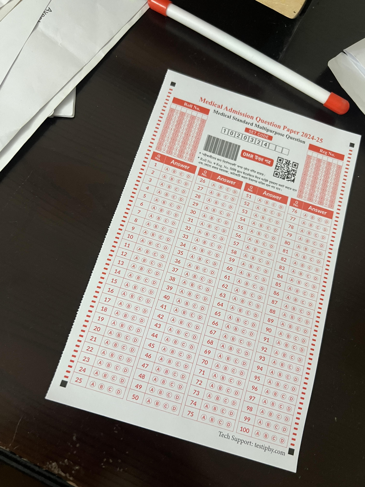
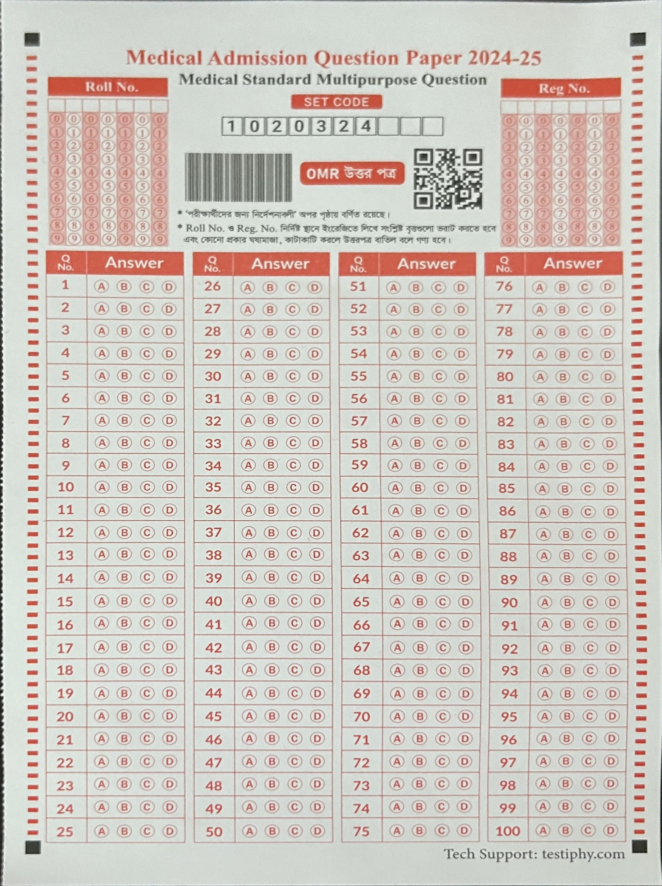
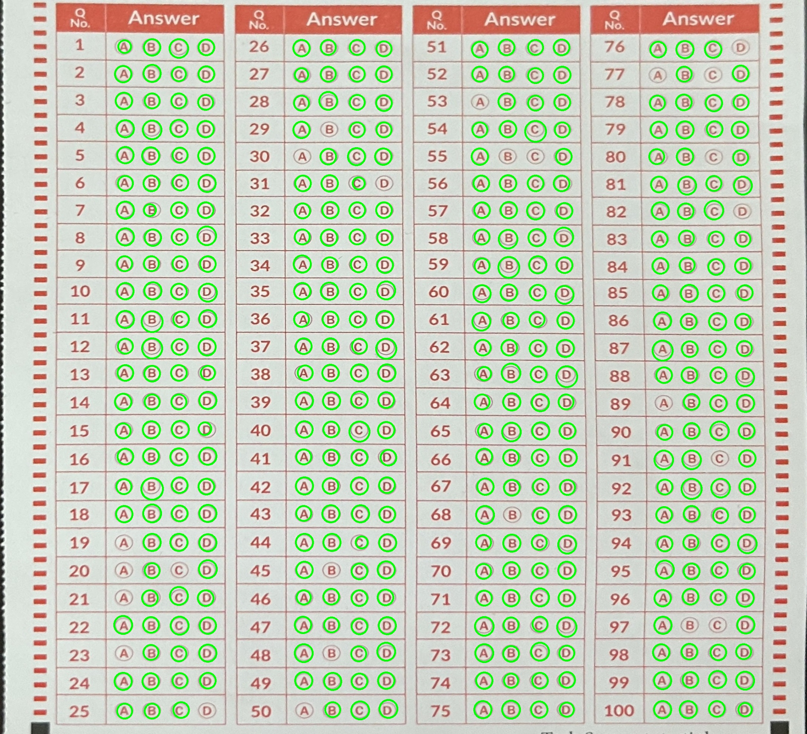

# Document Scanner and Bubble Detector

This project implements a document scanning and bubble detection pipeline using OpenCV and Python. It processes images to extract documents, enhance them and detect bubbles.


## Image Previews

### 1. Raw Image


### 2. Warped Image


### 3. Bubble Detected Image


## Features

### Document Scanning
- **Enhancement**: Applies sharpening and contrast adjustment using CLAHE.
- **Edge Detection**: Detects document boundaries via Canny edge detection and contour analysis.
- **Perspective Correction**: Warps the detected document to a top-down view for further processing.
- **Preprocessing Visualization**: Displays intermediate processing steps such as sharpening, grayscale conversion and edge detection.

### Bubble Detection
- **Adaptive Thresholding**: Enhances contrast for detecting bubbles.
- **Hough Circle Transform**: Detects circular regions (bubbles) in the image.
- **Bubble Count and Visualization**: Highlights detected bubbles and calculates their count.

## Requirements

Make sure you have the following installed:

- Python 3.x
- OpenCV
- NumPy
- Matplotlib

Install the dependencies using:

```bash
pip install opencv-python-headless numpy matplotlib
