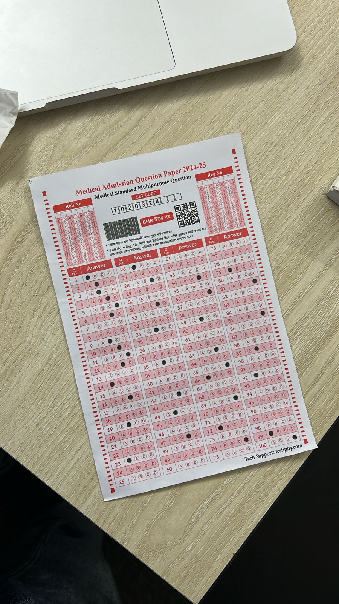
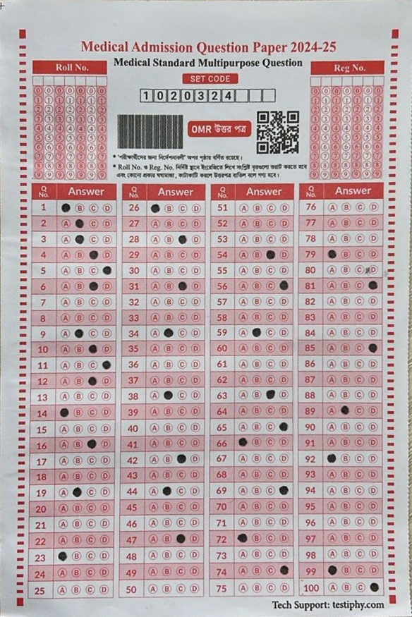
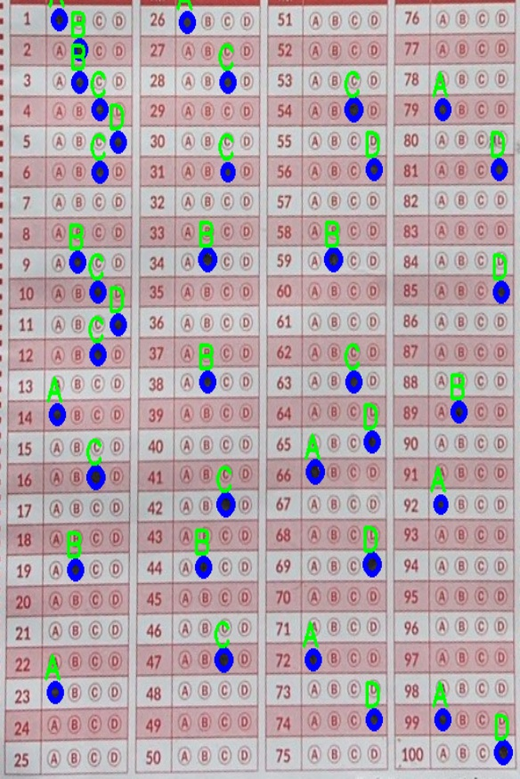

# Document Scanner and Bubble Detector

This project implements a document scanning and bubble detection pipeline using OpenCV and Python. It processes images to extract documents, enhance them, and detect bubbles.

## App Demo

You can try the OMR scanner app online at [this link](https://omr-scanner-saman.streamlit.app/).

## App Features
- Upload images for scanning.
- Get immediate results with accuracy percentages.
- View the number of correct answers for each image.

## Image Previews

### 1. Raw Image


### 2. Warped Image


### 3. Bubble Detected Image


## Results Summary

The following results are based on the images processed by the OMR scanner:

| Picture | Correct | Percentage |
|---------|---------|------------|
| Pic 1   | 59      | 0.59       |
| Pic 2   | 95      | 0.95       |
| Pic 3   | 93      | 0.93       |
| Pic 4   | 99      | 0.99       |

### Average Percentage
- **Average**: 0.865

## Code Features

### Document Scanning
- **Enhancement**: Applies sharpening and contrast adjustment using CLAHE.
- **Edge Detection**: Detects document boundaries via Canny edge detection and contour analysis.
- **Perspective Correction**: Warps the detected document to a top-down view for further processing.
- **Preprocessing Visualization**: Displays intermediate processing steps such as sharpening, grayscale conversion, and edge detection.

### Bubble Detection
- **Adaptive Thresholding**: Enhances contrast for detecting bubbles.
- **Hough Circle Transform**: Detects circular regions (bubbles) in the image.
- **Bubble Count and Visualization**: Highlights detected bubbles and calculates their count.
- **Answer Detection**: Identifies marked answers based on bubble fill ratio, displaying the detected answers on the image.

## Requirements

Make sure you have the following installed:

- Python 3.x
- OpenCV
- NumPy
- Matplotlib

Install the dependencies using:

```bash
pip install opencv-python-headless numpy matplotlib
